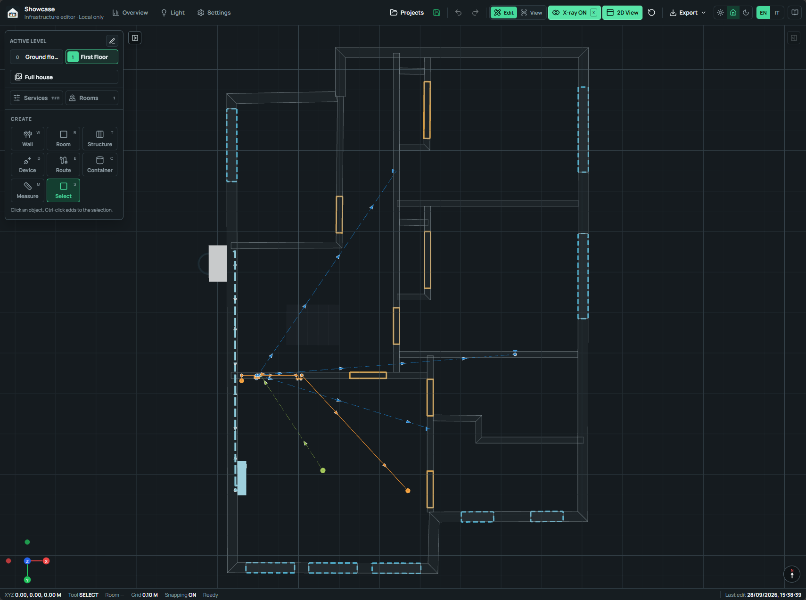
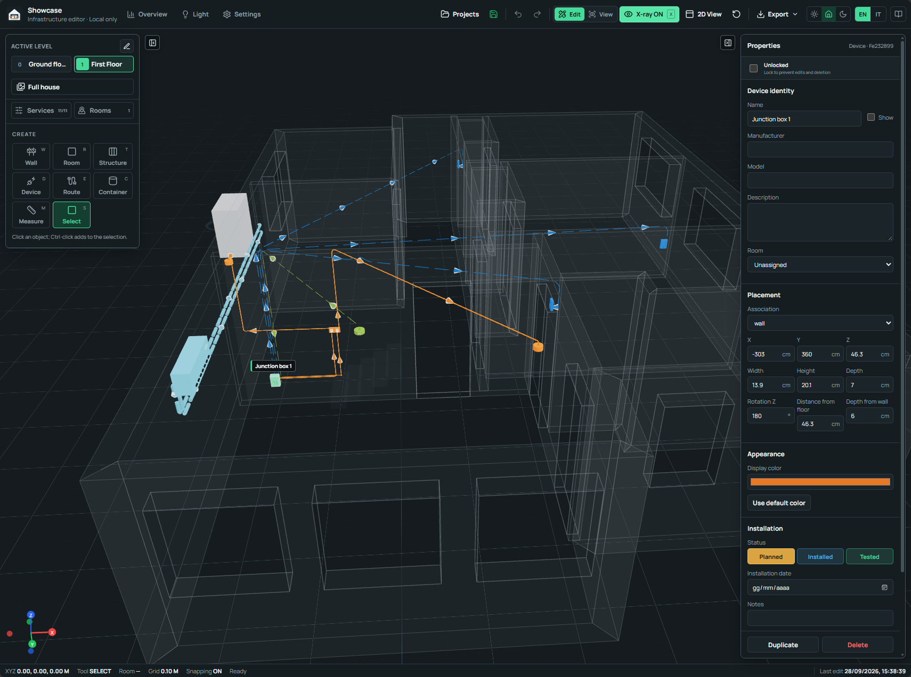

# Editor and view modes

  FEATURE 01
  
The main workspace keeps architectural context, technical objects, and precise metadata together. Edit mode exposes creation and Properties; View mode opens the model for uncluttered inspection and capture.

## EDIT 01 · Edit and View workspaces

The **Edit** and **View** switch is in the top toolbar. Both modes preserve the
active floor, camera, 2D or 3D projection, X-ray state, service visibility, and
room isolation.

=== "Edit"

    Edit enables the creation sidebar, object selection, Properties, clipboard
    actions, deletion, undo, redo, and precise geometry changes. Each sidebar
    has an independent edge control, so the model can remain wide while one
    panel stays open.

=== "View"

    View cancels an unfinished drawing, clears editing selection, and collapses
    both sidebars. Camera controls, floor selection, Full house, service
    visibility, X-ray, 2D View, theme, and language remain available. A
    **Capture current view** button appears inside the viewport.

The save icon reports local persistence at a glance: green indicates a saved
snapshot, the normal toolbar colour appears during saving, and red reports an
autosave problem.

## EDIT 02 · Floors and the house structure

Each project contains ordered floors with a name, elevation, ceiling height,
and optional blueprint. Floors are numbered relative to the level nearest
elevation zero. Selecting a floor isolates it; **Full house** displays every
level at its physical elevation.

The structure tools cover:

- walls with a structural core and independent left and right drywall linings;
- rooms with categories, descriptions, areas, and ceiling heights;
- doors and windows that cut their associated wall;
- square and round columns;
- path-based staircases;
- reference furniture and technical containers.

Wall drawing supports grid, endpoint, corner, cardinal-axis, and projected
wall snapping. After the first point, enter an exact length in metres and press
`Enter`; both decimal points and decimal commas are accepted. Wall Properties
exposes exact endpoints, height, layer thicknesses, finished thickness, and a
direct wall-scheme export action.

## EDIT 03 · Perspective, 2D plan, and orientation

**2D View** changes the active viewport to an orthographic top view. It is
suited to floor layout, room boundaries, wall openings, plan measurements, and
route review. Switch it off to return to the perspective camera.

<figure class="his-doc-media his-doc-media--wide">
  
  <figcaption>
    <strong>2D View with X-ray.</strong> The selected floor becomes a true top
    plan while routes, openings, rooms, and wall geometry retain their project
    coordinates.
  </figcaption>
</figure>

The lower-right north arrow follows the camera and can realign the view to
project north. The lower-left X/Y/Z gizmo communicates orientation. The status
bar reports cursor coordinates, tool, selected room, grid, snapping, notices,
and the local date and time of the last project edit.

## EDIT 04 · Blueprints and cross-floor alignment

The level manager accepts an image blueprint for each floor. Its calibration
workflow includes:

1. a two-point reference distance;
2. the project origin marker;
3. one registration point per floor;
4. a two-point north direction;
5. image rotation, position, opacity, and visibility.

Registered plans align to the elevation-zero floor while keeping the chosen
physical point fixed. The **Adjacent blueprint** option can project the nearest
lower plan in blue and the nearest upper plan in amber onto the active drafting
plane. This comparison is useful when placing risers, shafts, and related wall
geometry across levels.

## EDIT 05 · Devices, ports, and Properties

The catalogue covers electrical, lighting, data, Wi-Fi, CCTV, security, HVAC,
heating, plumbing, sensors, automation, storage, structural, and custom types.
Version 0.3.0 also adds separate indoor and outdoor camera definitions,
doorbells, and a PoE doorbell speaker, while retiring the previous video
intercom catalogue item during project upgrade.

Device placement records the exact association, mounting face, dimensions,
rotation, distance from the floor, and depth from the finished wall surface.
Ports carry service, connector, direction, physical position, face, occupancy,
and termination-space requirements.

<figure class="his-doc-media his-doc-media--wide">
  
  <figcaption>
    <strong>Selected junction box.</strong> Properties groups identity,
    placement, dimensions, appearance, installation state, notes, and object
    actions in one panel. The lock control protects a completed selection.
  </figcaption>
</figure>

Expandable junction boxes and electrical panels grow their schematic enclosure
to reserve the physical space requested by ports and connected route sizes.
Junction route endpoints terminate at the enclosure centre while their assigned
ports continue to carry correspondence and direction data.

## EDIT 06 · Measurements and room isolation

The Measurement tool records a straight 3D distance between two selected
targets. A target picker resolves overlapping walls, floors, rooms, devices,
structures, routes, and measurements at each endpoint. Measurement lines and
labels stay visible in the drafting foreground.

Custom measurement text is added before the calculated value, for example
`Socket centre, 1.25 m`. This preserves the measured length in the viewport and
in wall-scheme output.

Selecting a room from the Rooms popup or viewport activates its floor, fits the
camera, and isolates the room. Connected routes remain visible for one metre
beyond the room boundary so their direction and continuation stay legible.

## EDIT 07 · Spatial installation photographs

Photo documentation is integrated into the **Services** popup. Enable Photos,
choose **Add photo point**, click the model location, and assign a name,
description, and category. Available categories are Finished house, Cable
systems, Structural, Electrical, Data, Plumbing, HVAC, Security, and Other.

Each marker can hold several JPEG, PNG, or WebP images. Marker visibility starts
off when a project opens, then the category filters control which locations are
shown. The image files are stored in the matching local project workspace under
`assets/photos/`.

For input details and shortcuts, see [Controls](../user-guide/controls.md). To
inspect concealed services, continue with [X-ray and routes](xray-and-routes.md).
