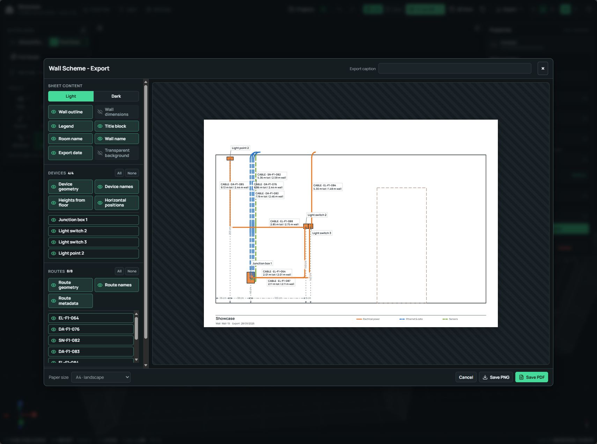

# Exports and field output

  FEATURE 06
  
House Infrastructure Studio turns the local model into printable wall schemes, current-view sheets, installation photographs, reports, and validated backups. Every export is generated on the current computer.

## EXPORT 01 · Wall schemes

Choose **Export → Selected wall scheme** for one wall, or **Batch wall schemes**
for a room, a manual wall selection, or the complete project. The preview uses a
distortion-free orthographic wall renderer.

<figure class="his-doc-media his-doc-media--wide">
  
  <figcaption>
    <strong>Wall Scheme Export.</strong> The paper preview combines wall
    geometry, installed routes, devices, dimensions, labels, legend, and title
    information for site work and later maintenance.
  </figcaption>
</figure>

### Scope and paper

Single-wall and batch exports support A2, A3, and A4 landscape paper at a fixed
5× print raster. Output is available as PNG or a self-contained single-page PDF.
Batch output creates a local ZIP with one file per wall. Repeated wall names
receive deterministic numeric suffixes.

### Sheet content

The left side of the dialog controls:

- light or dark style;
- wall outline and overall wall dimensions;
- legend and title block;
- room name, wall name, export date, and custom caption;
- transparent background for PNG output;
- device geometry, names, heights, and horizontal offsets;
- route geometry, names, and technical metadata;
- measurement lines and labels;
- visibility of each individual device, route, and measurement on the previewed
  wall.

Annotation blocks are placed into nearby free space and connected to their
anchors with leader lines. This layout reduces label collisions on dense wall
schemes. Custom measurement text keeps the calculated metric length beside it.

## EXPORT 02 · Current-view print sheet

Enter **View** mode, prepare the camera and visibility, then choose **Capture
current view**. The scene is captured in a light, low-ink style and placed on an
A2, A3, or A4 landscape sheet.

The scalable paper master contains the border, project name, caption, date, and
current north indicator. The 3D scene is captured at high resolution, while the
XYZ gizmo and drafting emphasis are removed from the final sheet. Save the
result as PNG or PDF.

The captured scene follows the current floor or Full house scope, camera,
service filters, room isolation, X-ray state, and 2D or perspective projection.

## EXPORT 03 · Overview and field review

Overview supplies live totals and filtered inventories that can be reviewed
before exporting. A practical field package can combine:

1. a status-filtered asset list from Overview;
2. one wall scheme for each work area;
3. a current-view sheet showing the spatial relationship;
4. installation photographs attached to their model locations;
5. the saved project backup retained by the project owner.

Wall sheets can include route dimensions, device positions, service labels, and
installation metadata for electricians, installers, and maintenance work on
site. Review each sheet against the latest saved project before use.

## EXPORT 04 · Photographs and backup boundaries

The JSON backup contains structured project data and photo metadata. Image bytes
remain in the matching project workspace under `assets/photos/`. A complete
recovery copy therefore includes both the exported JSON and the project
workspace when photographs are important.

Blueprint image data is included in the validated snapshot. The original plan
should also be retained as the authoritative source document.

## EXPORT 05 · Safe local output

Exports remain on the current computer until someone chooses to copy, send, or
publish them. Floor geometry, concealed services, equipment records, and
photographs can reveal sensitive information about a home. Inspect every file
before sharing it.

The full recovery procedure is in [Backups and exports](../user-guide/backups-and-exports.md).
Publication guidance is in [Publishing and updating on GitHub](../development/publishing.md).
