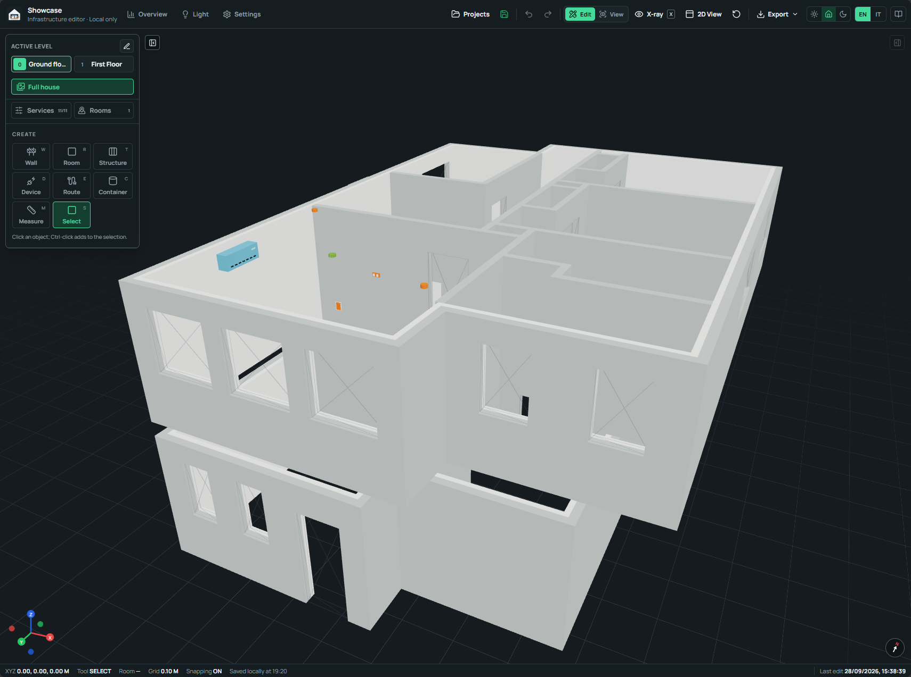

# Features

  VERSION 0.3.0
  
House Infrastructure Studio combines the architectural shell of a home with its electrical, data, plumbing, HVAC, security, automation, and other technical systems in one local 3D project.

The application is designed for residential documentation, installation planning,
field review, and later maintenance. Its focused scope keeps the model readable
while still recording exact geometry, positioned connections, installation
metadata, photographs, and printable output.

<figure class="his-doc-media his-doc-media--wide">
  
  <figcaption>
    <strong>Main interface.</strong> The full-house view keeps floors at their
    true elevations while the header provides Overview, Light, Settings,
    Edit/View, X-ray, 2D, export, theme, language, and documentation controls.
  </figcaption>
</figure>

## Choose an area

  <a class="his-feature-card" href="editor-and-views/">
    FEATURE 01
    <strong>Editor and view modes</strong>
    <small>Build floors, layered walls, rooms, openings, devices, measurements, blueprints, and spatial photo points.</small>
  </a>
  <a class="his-feature-card" href="xray-and-routes/">
    FEATURE 02
    <strong>X-ray and routes</strong>
    <small>Reveal concealed services, connect positioned ports, coordinate route geometry, and inspect continuity.</small>
  </a>
  <a class="his-feature-card" href="overview/">
    FEATURE 03
    <strong>Overview</strong>
    <small>Review whole-house quantities, service distribution, rooms, floors, devices, routes, and installation status.</small>
  </a>
  <a class="his-feature-card" href="light/">
    FEATURE 04
    <strong>Light</strong>
    <small>Trace documented cable continuity between switches, light points, panels, junctions, and risers.</small>
  </a>
  <a class="his-feature-card" href="settings/">
    FEATURE 05
    <strong>Settings</strong>
    <small>Define route rules, drafting behavior, identification, device defaults, rack systems, diagnostics, and local branding.</small>
  </a>
  <a class="his-feature-card" href="exports/">
    FEATURE 06
    <strong>Exports and field output</strong>
    <small>Create configurable wall schemes, current-view print sheets, batch ZIP packages, and validated project backups.</small>
  </a>

## One project, several working views

The editor, Overview, and Light areas read the same validated project snapshot.
Changes made in Edit mode flow into quantities, route continuity, diagnostics,
and exports after the project is saved. The selected floor and the full-house
scope provide two complementary ways to read the model.

| Working area | Best used for |
| --- | --- |
| **Edit** | Creating geometry, assigning ports, entering technical data, and correcting the project. |
| **View** | Navigating a clear model, changing visibility, and capturing the current scene. |
| **X-ray** | Inspecting and selecting concealed routes and devices through walls. |
| **2D View** | Drawing and reviewing the active floor from a true orthographic top view. |
| **Overview** | Reading quantities, service distribution, inventory, floors, rooms, and installation status. |
| **Light** | Auditing switch-to-light cable continuity on the active floor. |

## Local project record

Projects are saved on the current computer. The browser/server edition uses a
loopback API and a local SQLite database; the Windows edition bundles the same
workflow inside a Tauri desktop application. Each project has a dedicated
workspace for its validated JSON mirror and attached photograph files.

The application supports design and documentation work. Engineering decisions,
regulatory checks, and installation approval remain the responsibility of the
qualified people working on the project.

Continue with [Editor and view modes](editor-and-views.md), or follow the
[recommended modelling workflow](../user-guide/workflow.md) for a practical
sequence from the first floor plan to field output.
