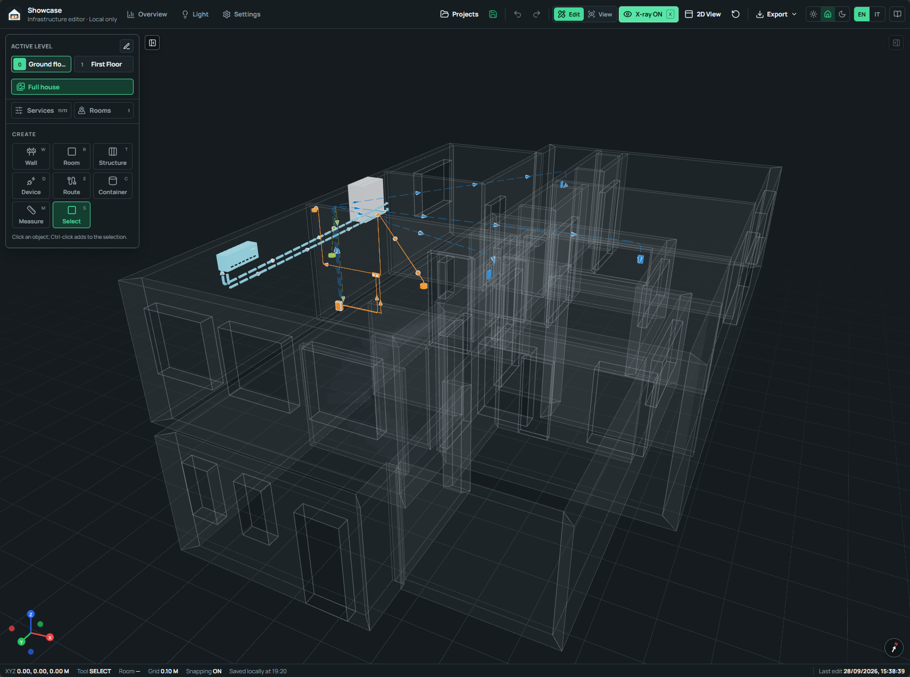

# X-ray and routes

  FEATURE 02
  
X-ray connects the visible house to the services inside its walls, floors, and ceilings. It reveals route geometry, enables route selection, and keeps the surrounding structure available as spatial context.

## XRAY 01 · Reveal concealed infrastructure

Use the **X-ray** button in the top toolbar or press `X`. Walls become highly
transparent, while technical devices, routes, measurements, openings, and
lightweight structures remain readable.

<figure class="his-doc-media his-doc-media--wide">
  
  <figcaption>
    <strong>Full-house X-ray.</strong> Concealed services remain anchored to the
    complete architectural model, including floor elevations, wall layers,
    openings, and cross-floor transitions.
  </figcaption>
</figure>

The Services popup controls which technical categories are visible. It also
contains the spatial photo filters. Selecting a device type temporarily enables
its service, which keeps a newly placed object visible during editing.

Selection follows the current inspection mode:

- Normal view selects walls, structures, and technical devices;
- X-ray adds cables, pipes, and ducts to the selectable objects;
- a visible route or device under the pointer receives priority through a
  transparent wall;
- a clear wall surface still selects the wall itself;
- routes use a narrow picking volume for consistent selection across wall,
  floor, ceiling, and vertical segments.

<figure class="his-doc-media his-doc-media--motion his-doc-media--wide">
  
  <figcaption>
    <strong>Navigation in X-ray.</strong> Orbit, pan, zoom, and change viewpoint
    while the concealed network stays aligned with the architectural shell.
  </figcaption>
</figure>

## ROUTE 01 · Start from explicit ports

Cables, pipes, and ducts connect positioned device ports. Choose the route kind
and service, click the source device, then select a compatible port from the
endpoint chooser. Add intermediate guidance points when installation intent
requires them, then click the destination device and choose its port.

The endpoint chooser presents free and occupied compatible ports in two
columns. The first endpoint may be input, output, or bidirectional. The second
endpoint follows a coherent direction, for example output to input. Occupied
ports can be reassigned deliberately before reuse.

When a device needs another connection, its 3D preview can create a positioned
instance port during the route workflow. Enter the connector, direction,
required face space, and name, then continue the pending route.

## ROUTE 02 · Structural path rules

The route planner evaluates the source, destination, guidance points, associated
walls, installed equipment, and project settings before committing geometry.

| Surface | Saved route behavior |
| --- | --- |
| Wall | Horizontal and vertical wall-local segments, contained inside the associated finished wall. |
| Floor | Direct concealed plan path with obstacle detours where equipment blocks the line. |
| Ceiling | Direct concealed plan path with the configured ceiling offset and obstacle detours. |
| Structural transition | A vertical change through an associated wall, column, or riser, with curvature fitted to the available structure. |

Exact device endpoints remain attached to their rotated device-local
termination. Terminal approaches can cross their own device clearance zone;
middle segments observe the full equipment envelope. Door and window openings
receive a 10 cm route exclusion zone on their wall.

Compatible routes may share a concise corridor when its detour is small and
straightforward. Separate lateral lanes preserve individual runs. Existing
installed paths are processed before later paths, which keeps older geometry
stable while a new route finds clearance.

## ROUTE 03 · Clearances, size, and curved geometry

Route coordination combines the configured centreline separation with physical
size. Explicit conduit diameter, pipe external diameter, and duct dimensions
take priority; each service also has a default installed diameter in Settings.

Runs up to 4 cm use a lightweight drafting line. Larger routes render as
physically scaled cylindrical geometry. Patterned services keep their visible
dash pattern on the tube.

At a conflict, the planner can separate parallel routes laterally or introduce
a local concealed crossing profile. Floor crossings rise toward the finished
floor, ceiling crossings move deeper into the ceiling, and wall crossings use
another valid depth layer. The crossing profile is stored for accurate
rendering while remaining outside the editable turning-point list.

Turn curvature is set per service. It affects wall corners, equipment detours,
and structural transitions. Short lane connectors are compacted when the
configured bend radius would produce an awkward pair of closely spaced turns.

## ROUTE 04 · Gravity grades for pipes and ducts

Version 0.3.0 adds project-level gravity grades for pipe and duct routes.
Settings stores the minimum percentage, and the route uses the selected flow
direction to determine its fall. The default pipe grade is 1%, and the default
duct grade is 0.5%.

The grade applies to concealed floor and ceiling planes as well as shallow wall
runs. Device endpoints retain their exact height. Crossing-clearance curves are
placed on the graded baseline, so the route returns smoothly to its intended
fall after the crossing.

## ROUTE 05 · Flow and turning points

Select a route in X-ray to edit its endpoint strip, flow direction, physical
specification, installation state, testing data, notes, and turning points.
The centre control cycles through `A → B`, `A ← B`, bidirectional, and
unspecified flow.

Directed routes show evenly spaced moving markers while X-ray is active. The
Drafting settings can keep these markers animated or stationary. Automatic
crossing points are excluded from point numbers and turn counts; authored
points remain available for insertion, exact coordinate edits, removal, and
the **Square route** action.

## ROUTE 06 · Junctions, panels, and floor transitions

Choose **Junction** in Route setup to split an existing route or place a
standalone branch point. Junction boxes and electrical panels use explicit
incoming-to-outgoing correspondence groups to describe continuity across their
connected routes.

A **Floor transition** links adjacent levels. Place it in plan, choose the
second floor, and pair each route below with its continuation above. A valid
pair uses the same kind and service and shares one physical sleeve lane. The
riser expands from its minimum diameter when additional installed route sizes
require more space.

## ROUTE 07 · Diagnostics and coordinated repair

**Settings → Project diagnostics** gathers several checks in one review area:

- route layout opportunities and remaining clearance conflicts;
- cable runs beyond the 10 m target plus 1 m tolerance;
- unpaired or directionally imbalanced floor-transition routes;
- incomplete panel and junction correspondence;
- technical devices without a route attachment.

Conflict review selects the affected routes in X-ray, moves the camera to the
3D location, and marks the issue. A coordinated proposal can compare the
current and suggested conflict, turn, and length metrics before applying its
route set as one project edit.

For everyday inputs, see [Controls](../user-guide/controls.md). For project-wide
route rules, continue with [Settings](settings.md).
