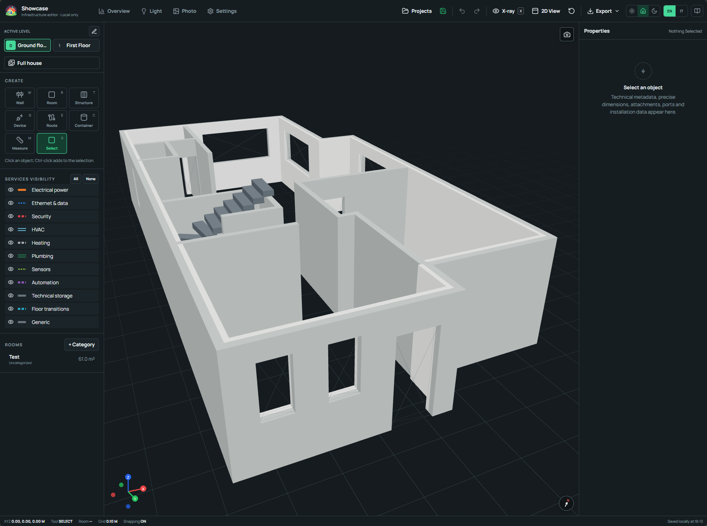
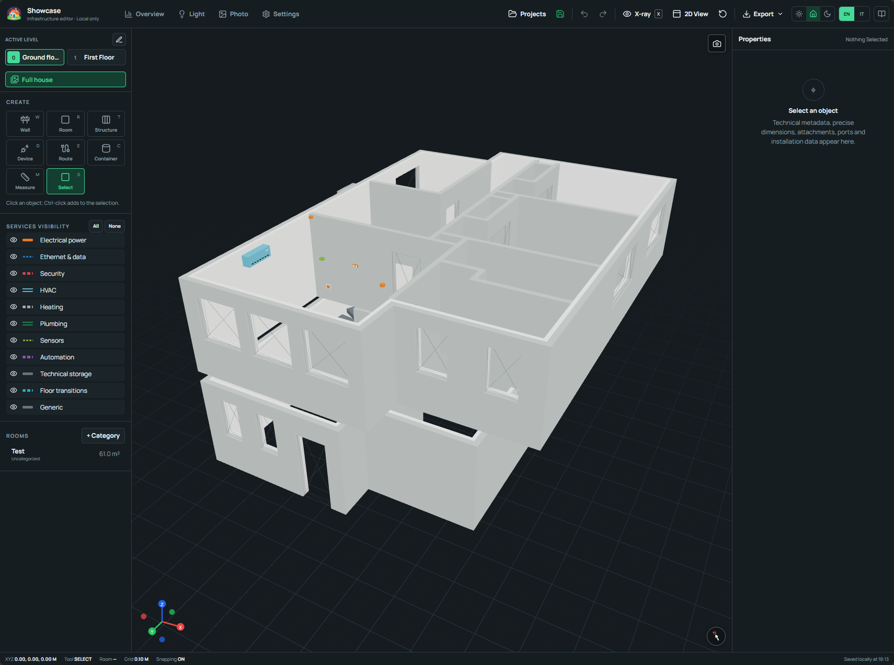

# Capabilities

House Infrastructure Studio brings the architectural context and concealed
technical services of a home into one local 3D record. Version 0.1.21 focuses
on residential-scale work, with deliberate geometry, traceable connections,
and practical field documentation.

The application has a deliberately focused scope suited to individual homes and
similar residential projects. It supports design and documentation work while
leaving engineering decisions and applicable installation standards with the
people responsible for the project.

## A coordinated model of the home

Each project can cover several ordered levels and preserve their physical
relationship through elevation-based numbering, a common origin, and shared
floor transitions. The same model combines the visible building layout with
the services that will eventually sit inside walls, floors, and ceilings.

- Draw walls, layered wall assemblies, rooms, doors, windows, columns,
  staircases, and reference furniture with metric dimensions.
- Calibrate a plan image from two known points, register it to the project
  origin, set north with a drawn direction, and compare adjacent-floor walls.
- Work in perspective or orthographic plan view, then isolate a room, wall,
  floor, selection, or the complete house.
- Use a metric grid, snapping, measurements, object locks, service visibility,
  and X-ray inspection during detailed editing.

  <figure class="his-doc-media">
    
    <figcaption>
      <strong>Active-level view.</strong> Architectural context stays clear while
      the sidebars provide creation tools, visibility controls, and precise
      properties.
    </figcaption>
  </figure>
  <figure class="his-doc-media">
    
    <figcaption>
      <strong>Full-house view.</strong> Ordered levels share one coordinate system
      and remain visible at their true elevations.
    </figcaption>
  </figure>

## Technical objects and precise connections

The catalogue covers electrical, data, Wi-Fi, security, HVAC, heating,
plumbing, automation, storage, furniture, and custom equipment. Every placed
object can carry exact dimensions, a mounting face, height, room association,
installation details, technical properties, and a controlled display style.

Connections use positioned ports on the 3D object. A port records its service,
connector, direction, occupancy, and required termination space. New ports can
be placed directly on the object preview when a device needs a project-specific
connection point. Electrical panels and junction boxes expand their schematic
enclosures as termination requirements grow.

Racks receive a dedicated physical layout with U positions, front and rear
faces, patch-panel pairs, internal leads, and house-facing endpoints. Port
details can include labels, network speed, PoE, media, voltage, and power.

## Routes, risers, and coordination

Cables, pipes, and ducts connect explicit compatible ports. The route planner
uses the selected wall, floor, and ceiling surfaces to build a concise path,
then applies the project clearances, physical diameters, service order, device
envelopes, and opening exclusions.

- Concealed floor and ceiling runs can cross their complete structural plane;
  wall runs are organized into readable horizontal and vertical segments.
- Parallel services receive separate lateral lanes, and structural crossings
  use local depth or height changes to preserve clearance.
- Turn curvature, installed diameter, separation, tier, and routing priority are
  configurable by service category.
- Floor transitions pair adjacent-level routes into documented sleeve lanes.
- Diagnostics can prepare up to six coordinated route-cluster proposals with
  conflict, bend, and length comparisons for review before application.

Italy-oriented conductor, conduit, pipe, and Ethernet-pair defaults provide a
useful starting point. Their functional meaning, physical product colour, and
display colour remain separate and editable throughout the project.

<figure class="his-doc-media his-doc-media--motion">
  
  <figcaption>
    <strong>X-ray mode.</strong> Switching the view on reveals devices and routes
    through the architectural surfaces while preserving their spatial context.
  </figcaption>
</figure>

## Lighting and installation photographs

The Light view traces documented cable continuity from switches to light
points, including the panels, junctions, and paired risers involved in each
path. Selecting a light point highlights its controlling switches and keeps the
active level easy to read.

Photo mode places JPEG, PNG, or WebP installation photographs in their spatial
context. Markers become especially useful while surfaces are still open, when
the visible installation can be checked against the 3D record and preserved for
future maintenance.

## Review, reports, and field output

The Overview page derives whole-house totals, asset inventories, room and zone
grouping, and diagnostic summaries from the active project snapshot. Review
checks cover route clashes, long cable runs, incomplete risers, invalid
correspondences, and devices awaiting a route connection.

Field-ready output includes:

- an orthographic A4 wall-elevation PNG for one wall;
- deterministic batch wall schemes packaged as a ZIP file;
- a high-resolution, low-ink A4 image of the current 3D view;
- a validated JSON project backup for later import.

<figure class="his-doc-media his-doc-media--motion">
  
  <figcaption>
    <strong>Feature tour.</strong> Overview, Light, Photo, and Settings provide
    focused workspaces for review, documentation, and project configuration.
  </figcaption>
</figure>

## Editing, language, and local operation

Autosave uses the same validated transaction path as the Save command. A
50-state session history supports undo and redo, while the normalized SQLite
database and per-project workspace preserve the saved result. The first-project
tutorial introduces levels, blueprints, drawing tools, properties, reports,
lighting, photographs, views, and theme controls inside the application.

English and Italian interface dictionaries cover the editor controls. Names,
notes, technical descriptions, and other project content stay exactly as the
user enters them.

Both editions keep the working project on the local computer. The browser
edition serves the editor and API on `127.0.0.1:4280`; the Windows desktop
edition uses its private sidecar API on `127.0.0.1:4281` and stores projects in
the application-data directory. Authentication, analytics, telemetry, cloud
sync, and remote project storage are absent from the runtime.
